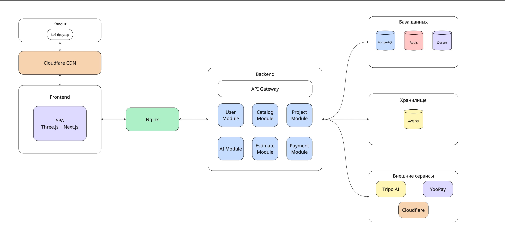

# Техническая спецификация проекта Planorama

## 1. Общее описание и цели

### 1.1 Техническое резюме
Planorama — это сервис для проектирования интерьера и закупки всего необходимого «под ключ», который объединяет 3D-конструктор, умный подбор комплектов под бюджет и требования, а также автоматическое формирование сметы и списка покупок.

## 2. Высокоуровневая архитектура

### 2.1 Архитектурный стиль: Монолит

### 2.2 Схема

## 3. Технологический стек

### 3.1 Frontend
- **Фреймворк:** Custom JS SPA
- **Язык:** JavaScript ES6+, версия 5.0.0
- **3D-движок:** Three.js + WebGL
- **Архитектура:** MVVM
- **Тип приложения:** SPA
- **Сборщик:** WebPack, версия 5.0
- **State Management:** Custom
- **UI библиотека:** Custom CSS
- **HTTP клиент:** Fetch
- **Тестирование:** Jest, версия 29.5.0

### 3.2 Backend
- **Язык:** Go, версия 1.25.0
- **Архитектура:** Clean Architecture, Momolith
- **Аутентификация:** JWT/OAuth 2.0
- **Документация API:** Swagger/OpenAPI
- **Валидация:** Custom 3D validators 
- **Фоновые задачи:** AWS SQS + Lambda

### 3.3 Слой данных
- **PostgreSQL** - база данных для метаданных и данных пользователей
- **Redis** - база данных для кэширования. Например, кэширование библиотеки моделей мебели
- **AWS S3** - хранилище для библиотеки моделей мебели, комнаты/пространства для каждого пользователя
- **Qdrant** - векторная база данных для хранения векторизированных моделей мебели для сравнения с импортированными моделями

### 3.4 Инфраструктура и DevOps
- **Контейнеризация:** Docker
- **Оркестрация:** Docker Compose, K8s
- **CI/CD:** GitHub Actions
- **IaC:** Terraform
- **Веб-сервер:** Nginx
- **CDN:** Cloudflare
- **Мониторинг:** Prometheus + Grafana

## 4. Внешние интеграции и API

### 4.1 Интегрируемые сервисы
- **Платежи:** YooPay, тип интеграции: REST API
- **Разпознование 3D-модели по фото:** Tripo Ai, тип интеграции: REST API
- **Хранилище файлов:** AWS S3, тип интеграции: SDK
- **CDN:** Cloudflare, тип интеграции: SDK

### 4.2 Политики повторных попыток
- **Стандартная политика:** Exponential backoff
- **Максимальное количество попыток:** 3
- **Таймаут между попытками:** 1s, 2s, 4s

## 5. Качество кода, тестирование и мониторинг

### 5.1 Тестирование
- **Unit тесты:** Инструменты: Jesty, целевое покрытие: 80%
- **Интеграционные тесты:** Инструменты: go test, целевое покрытие: 70%
- **E2E тесты:** Инструменты: Playwright, целевое покрытие: 60%
- **3D-тесты:** Three.js snapshots, целевое покрытие: 90%

### 5.2 Мониторинг и логирование
#### 5.2.1 Логирование
- **Уровни логирования:** error, warn, info, debug
- **Формат:** JSON (structured logging)
- **Транспорт:** Elastic Stack
- **Поля в логах:**
  - timestamp
  - level
  - message
  - userId
  - requestId

#### 5.2.2 Метрики и алертинг
- **Response time p95:** Тип: Gauge, порог для алерта: > 500ms
- **AI processing time:** Тип: Histogram, порог для алерта: > 300s
- **Error rate:** Тип: Counter, порог для алерта: > 1%
- **CPU usage:** Тип: Gauge, порог для алерта: > 80%
- **Memory usage:** Тип: Gauge, порог для алерта: > 90%
- **CloudFront cache hit:** Тип: Gauge, порог для алерта: < 90%
- **WebGL Context Lost:** Тип: Counter, порог для алерта: > 0.5%
- **FPS:** Тип: Gauge, порог для алерта: < 30 fps
- **3D Model Load Time p95:** Тип: Histogram, порог для алерта: > 3000ms

## 6. Производительность и масштабируемость

### 6.1 Целевые показатели
- **Time to Interactive (TTI):** < 3 секунд
- **First Contentful Paint (FCP):** < 1.5 секунд
- **Время ответа API (p95):** < 200ms
- **Availability:** 99.9%

### 6.2 Оптимизации
#### 6.2.1 Фронтенд
- LOD для моделей мебели
- Geometry Instancing
- Code splitting по маршрутам
- Оптимизация изображений (WebP, lazy loading)
- Кэширование статических ресурсов

#### 6.2.2 Бэкенд
- Кэширование запросов к БД
- Оптимальные индексы в БД
- Connection pooling для БД
- Lambda для AI-обработки
- S3 Transfer Acceleration
- Асинхронная обработка тяжелых операций

### 6.3 План масштабирования
- **Горизонтальное масштабирование:** Автоскейлинг группы инстансов бэкенда
- **Вертикальное масштабирование:** Увеличение размера инстанса БД
- **Геораспределение:** Развертывание в нескольких регионах