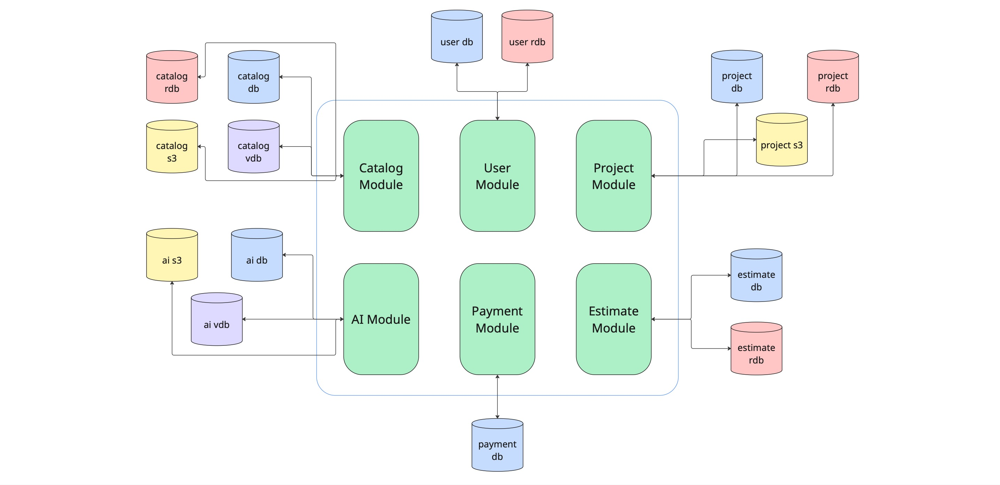

# Архитектура Planorama

## 1. Обзор системы

## 2. Архитектура Фронтенда: MVVM

## 3. Архитектура Бэкенда

- **Архитектура:** Модульный монолит
- **Архитектурный стиль модулей:** Clean Architecture

### 3.1 Диаграмма

### 3.2 Модули:

#### User Module
- **Ответственность:** управление пользователями, сессиями, ролями и правами доступа
- **Базы данных:** PostgreSQL, Redis
- **Интеграции:** JWT, OAuth 2.0

#### Project Module
- **Ответственность:** Управление проектами, сценами, версионированием
- **Базы данных:** PostgreSQL, AWS S3, Redis

#### Catalog Module
- **Ответственность:** Каталог 3D моделей, материалов, текстур
- **Базы данных:** PostgreSQL, Redis, AWS S3, Qdrant
- **Интеграции:** Партнерские каталоги мебели (IKEA API)

#### AI Module
- **Ответственность:** Обработка изображений, распознавание 3D моделей, рекомендации
- **Базы данных:** PostgreSQL, AWS S3, Qdrant
- **Интеграции:** Tripo AI

#### Estimate Module
- **Ответственность:** Формирование смет, управление товарами
- **Базы данных:** PostgreSQL, Redis

#### Payment Module
- **Ответственность:** Обработка платежей
- **Базы данных:** PostgreSQL
- **Интеграции:** YooPay