# Ответы респондентов для подтверждения концпеции
Наша команда провела опрос среди молодых людей возраста от 20 до 40 лет для изучения интереса к нашему продукту. В опросе приняли участие 131 человек. В вопросах допускался как один вариант ответа, так и несколько.

## Вопросы
1. **Как часто вы сталкиваетесь с задачами планировки интерьера?**
   - В данный момент активно занимаюсь ремонтом/перепланировкой
   - Планирую начать в ближайшие 3 месяца
   - Планирую начать в ближайший год
   - Занимаюсь этим профессионально (проекты для клиентов)
   - Редко, только при переезде/смене обстановки

2. **Каков ваш ориентировочный бюджет на обустройство интерьера?**
   - До 200 000 руб.
   - 200 000 - 500 000 руб.
   - 500 000 - 1 000 000 руб.
   - 1 000 000 - 2 000 000 руб.
   - Более 2 000 000 руб.

3. **Какими инструментами пользуетесь для планировки интерьера сейчас?**
   - Бумага и ручка
   - Графические редакторы (Photoshop, Illustrator)
   - Специализированные программы (SketchUp, 3ds Max, AutoCAD)
   - Онлайн-конструкторы (Planner 5D, Homestyler)
   - Мобильные приложения
   - Не пользуюсь никакими инструментами

4. **С какими сложностями сталкиваетесь при планировке интерьера? (выберите 3)**
   - Трудно представить конечный результат
   - Сложно подобрать сочетающуюся мебель
   - Не уверен, влезет ли мебель в помещение
   - Боюсь превысить бюджет
   - Не могу оптимально расставить мебель
   - Сложно координировать закупки

5. **Как подбираете мебель и материалы сейчас?**
   - Лично обхожу магазины
   - Ищу в интернет-магазинах
   - Консультируюсь с дизайнером
   - Пользуюсь каталогами производителей
   - Сохраняю варианты из соцсетей

6. **Какие функции для вас наиболее ценны? (выберите 3)**
   - Точная 3D-визуализация помещения
   - Автоматический подбор мебели под бюджет
   - Поиск мебели по фото
   - Готовая смета с возможностью покупки
   - Совместная работа над проектом
   - Библиотека готовых планировок
   - Расчет освещения
   - AR-просмотр через камеру

7. **Насколько вероятно, что вы бы стали пользоваться таким сервисом?**
   - 1 (точно нет)
   - 2
   - 3
   - 4
   - 5
   - 6
   - 7
   - 8
   - 9
   - 10 (обязательно)

8. **В каком формате предпочли бы использовать сервис?**
   - Веб-версия на компьютере
   - Мобильное приложение
   - Планшетная версия
   - Десктопное приложение

9. **Какой вариант монетизации кажется наиболее справедливым?**
   - Бесплатный базовый функционал, плата за расширенные возможности
   - Подписка с полным доступом
   - Оплата за проект
   - Бесплатно, но с комиссией при покупке
   - Бесплатно, но с рекламой

10. **Какую сумму готовы платить ЕЖЕМЕСЯЧНО за полный доступ?**
    - Не готов платить
    - До 300 руб.
    - 300 - 500 руб.
    - 500 - 1000 руб.
    - Более 1000 руб.
    - Предпочел бы годовую подписку

11. **За какие функции готовы платить отдельно? (выберите 3)**
    - Расширенная библиотека премиум-мебели
    - Консультация профессионального дизайнера
    - Экспорт в высоком качестве для печати
    - Неограниченное количество проектов
    - Приоритетная поддержка
    - Автоматическое отслеживание акций
    - История изменений проекта

12. **Что может стать решающим аргументом для оплаты подписки? (выберите 2)**
    - Экономия времени
    - Избежание ошибок при покупке
    - Экономия денег
    - Профессиональный результат
    - Удобство заказа в одном месте
    - Возможность видеть результат до покупки

13. **Сколько времени готовы потратить на обучение работе с сервисом?**
    - До 30 минут
    - 1-2 часа
    - 3-5 часов
    - Готов потратить сколько потребуется
    - Ожидаю интуитивно понятный интерфейс

14. **Какие интеграции были бы полезны? (выберите 3)**
    - Онлайн-магазины мебели
    - Строительные магазины
    - Сервисы по поиску мастеров
    - Банки для расчёта рассрочки
    - Pinterest для сохранения идей
    - Соцсети, чтобы делится результатами

15. **Как предпочитаете обучаться использованию сложных инструментов?**
    - Видеоуроки
    - Пошаговые инструкции внутри сервиса
    - Вебинары
    - Документация
    - Самостоятельное изучение

16. **Что может остановить от использования сервиса? (выберите 3)**
    - Сложность интерфейса
    - Необходимость точных исходных данных
    - Ограниченность каталога
    - Высокая стоимость
    - Необходимость установки программы
    - Беспокойство о конфиденциальности
    - Отсутствие мобильной версии
    - Необходимость мощного компьютера

17. **Хотели бы получить уведомление о запуске или участвовать в бета-тестировании?**
    - Да, отправьте информацию на email
    - Да, готов участвовать в бета-тестировании
    - Нет, спасибо

18. **Оцените важность возможности создания нескольких проектов одновременно**
    - Очень важно
    - Важно
    - Не важно

19. **Насколько важна возможность поделиться проектом с другими?**
    - Очень важно
    - Важно, но не обязательно
    - Не важно

20. **Как часто меняете планировку/обстановку в жилье?**
    - Раз в несколько лет
    - При переезде
    - Постоянно что-то меняю
    - Редко

## Ответы

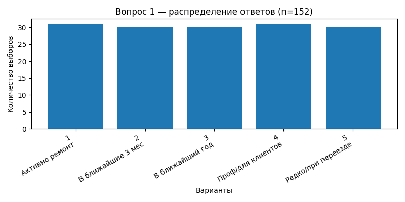
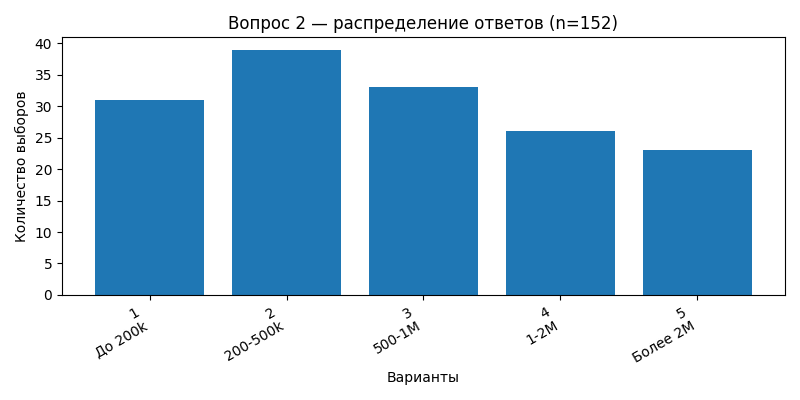
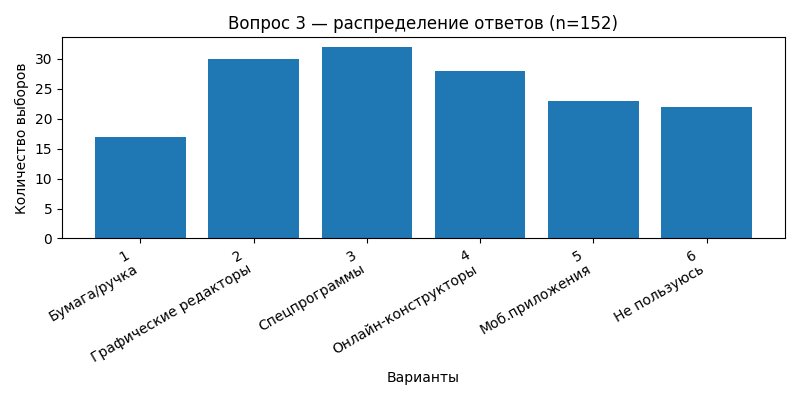

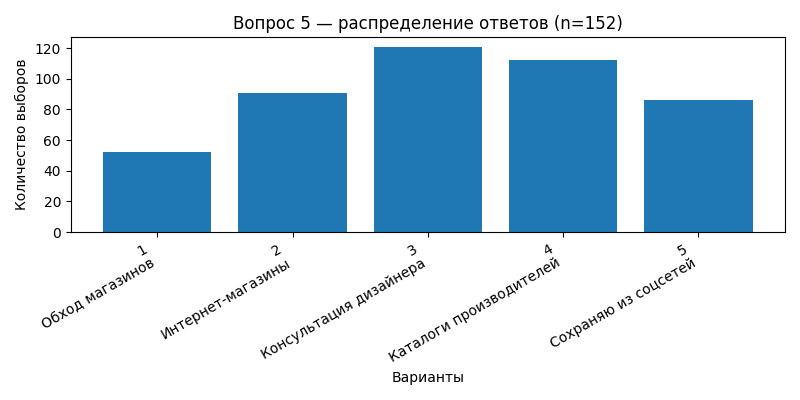
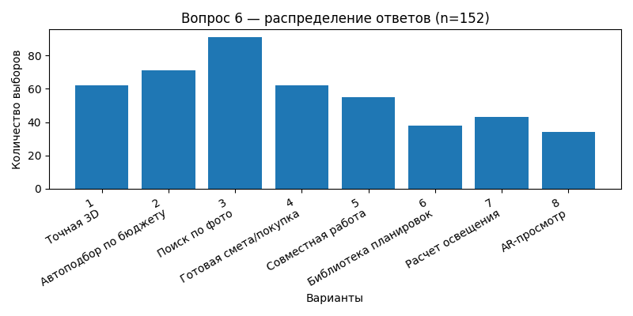
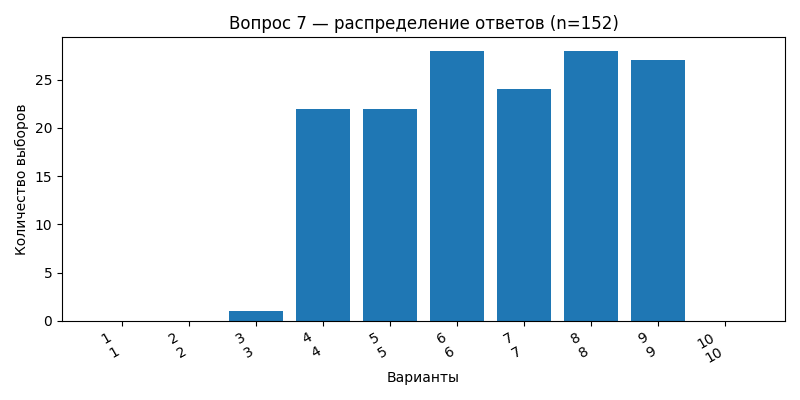
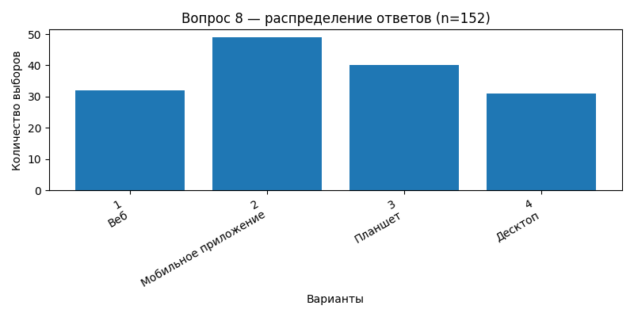
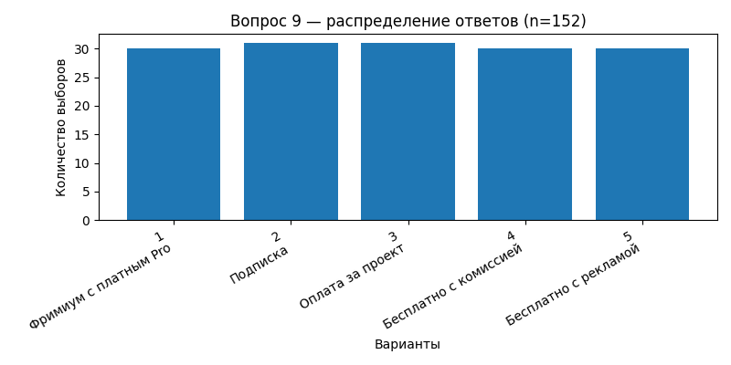
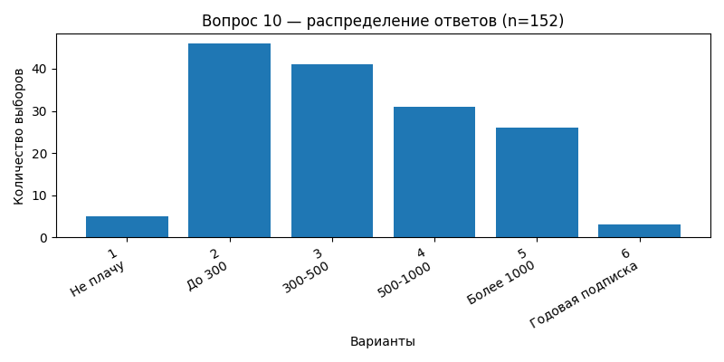
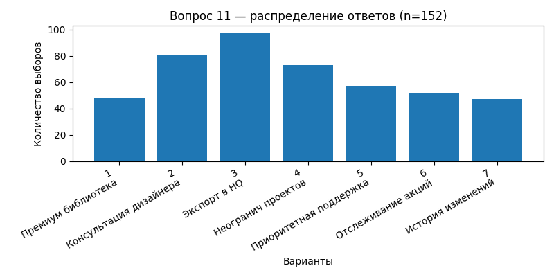
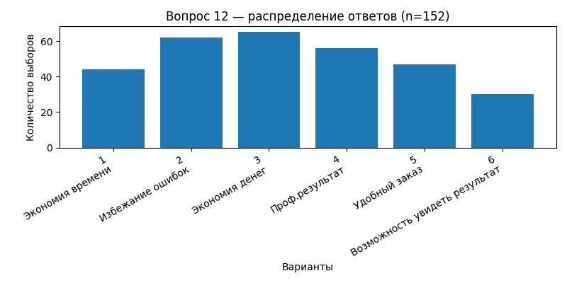
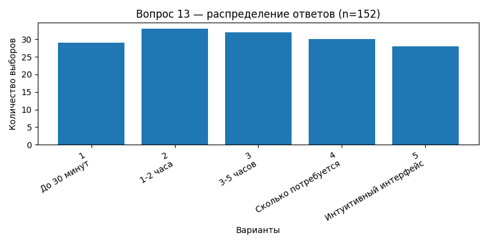
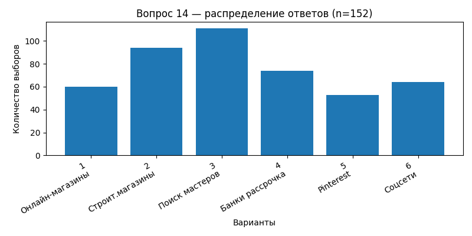
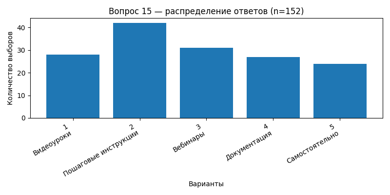
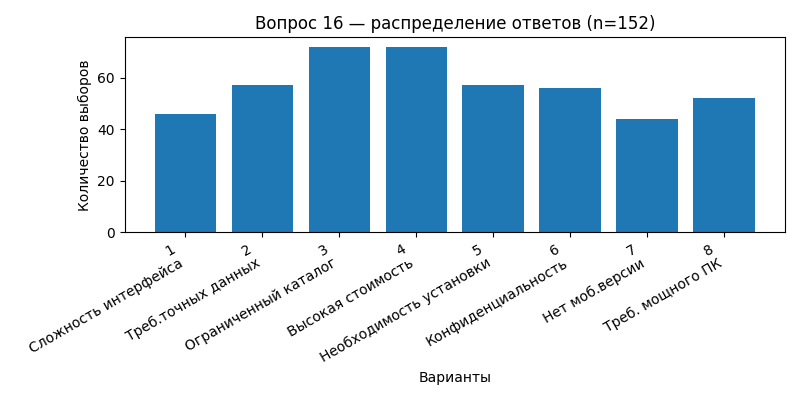

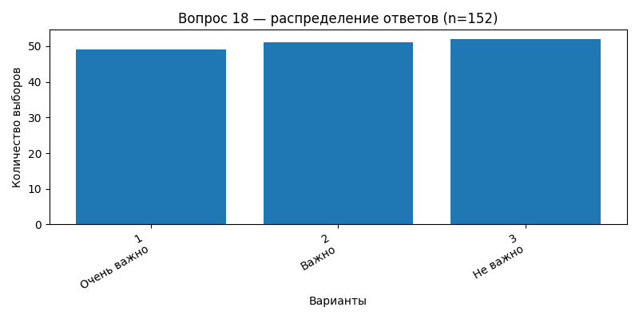
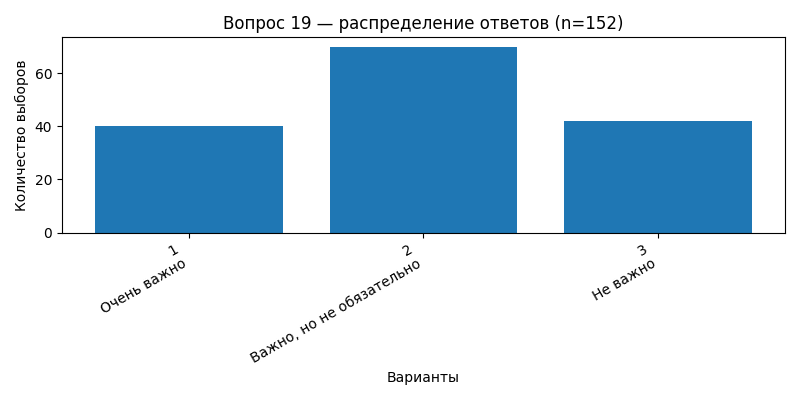
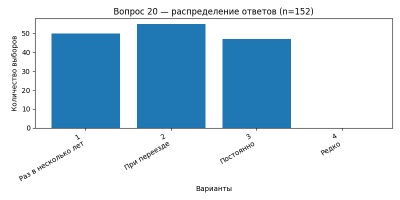
